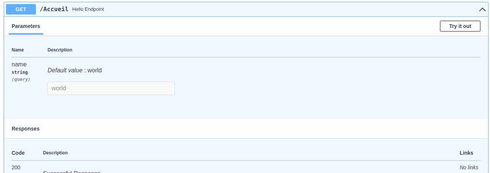
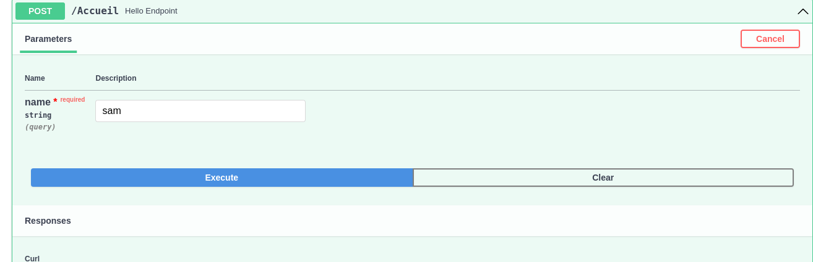
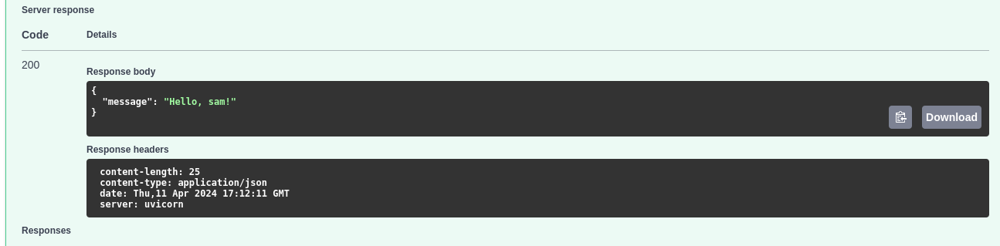
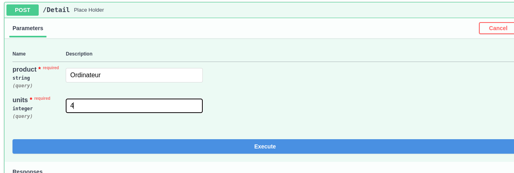
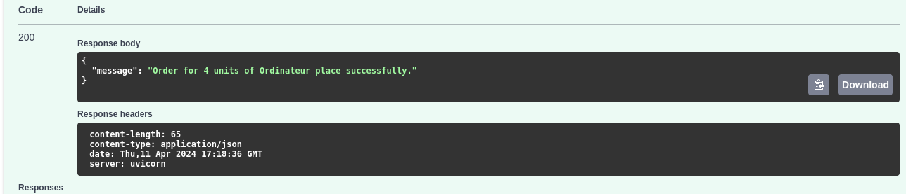
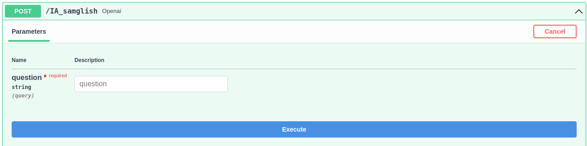

# fastApiGlish1 | SAMGLISH
create ChatGPT openai api with FASTAPI

***Pour commencer installer***
* fastapi
* uvicorn
* openai
* pydantic 
## Installation automatique

```terminal
pip install -r requirements.txt
```
## Installation manuelle

1. installer fastapi

```terminal
pip install fastapi
```
2. installer openai

```terminal
pip install openai
```
3. installer pydantic

```terminal
pip install pydantic
```
4. instaler le serveur uvicorn

```terminal
pip install "uvicorn[standard]"
```
***En ajoutant standard, Uvicorn va installer et utiliser quelques dépendances supplémentaires recommandées.Cela inclut uvloop, le remplaçant performant de asyncio, qui fournit le gros gain de performance en matière de concurrence.***

## Pour comprendre FastApi

nous allons commencer par quelques programmes fastapi

***un programme fastapi qui prend le nom d'une personne et renvoie Hello, suivi du nom de la personne***
nom du fichier test1.py
```python
from fastapi import FastAPI
app=FastAPI()
@app.post("/Accueil") 
async def hello_endpoint(name: str = 'world'):
    return {"message":f"Hello, {name}!"}
```
sur votre terminal lancer :

```terminal
uvicorn test1:app --reload
````
```terminal
INFO:     Uvicorn running on http://127.0.0.1:8000 (Press CTRL+C to quit)
INFO:     Started reloader process [149858] using watchgod
INFO:     Started server process [149872]
INFO:     Waiting for application startup.
INFO:     Application startup complete.
^CINFO:     Shutting down
INFO:     Waiting for application shutdown.
INFO:     Application shutdown complete.
INFO:     Finished server process [149872]
INFO:     Stopping reloader process [149858]
```
allez sur votre navigateur et taper http://127.0.0.1:8000/docs/
***n'oubliez pas d'ajouer docs***




***cliquez sur try out***



***Reponse du serveur***



*** un programme prenant en entrée deux variables product et units
```python
@app.post("/Detail")
async def place_holder(product:str, units:int):
    return {"message":f"Order for {units} units of {product} place successfully."}

```



***Reponse du serveur***



# Revenons sur le projet principal CHATGPT
***commencons par notre chatgpt dans fichier api.py***
```python
import openai
openai.api_key="Votre API-KEY"
def generate_description(input):
    messages=[
        {"Role":"System",
        "Content":"""As a product description generator, generate multi paragraph rich text product description\n"""},
    ]
    messages.append({"role":"user", "content":f"{input}"})
    completion=openai.chat.completions(
        model="gpt-3.5-turbo",
        messages=messages
    )

    reply=completion.choices[0].message.content
    return reply
```
pour plus de details sur open Ai cliquez <a href="https://openai.com/">ici</a>

***maintenant appelons notre fonction generate_description(input) dans le main***
```python
from fastapi import FastAPI
from pydantic import BaseModel
from api import generate_description
app=FastAPI()
class Product(BaseModel):
    name:str
    notes:str
@app.post("/IA_samglish")
async def Openai(question:str) :
    reponse=generate_description(f"name:{question.name},notes:{question.notes} ")
    return {"reponse": reponse}
```
***lancons notre terminal***
```terminal
uvicorn main:app --reload
```
***navigateur maintenant***

